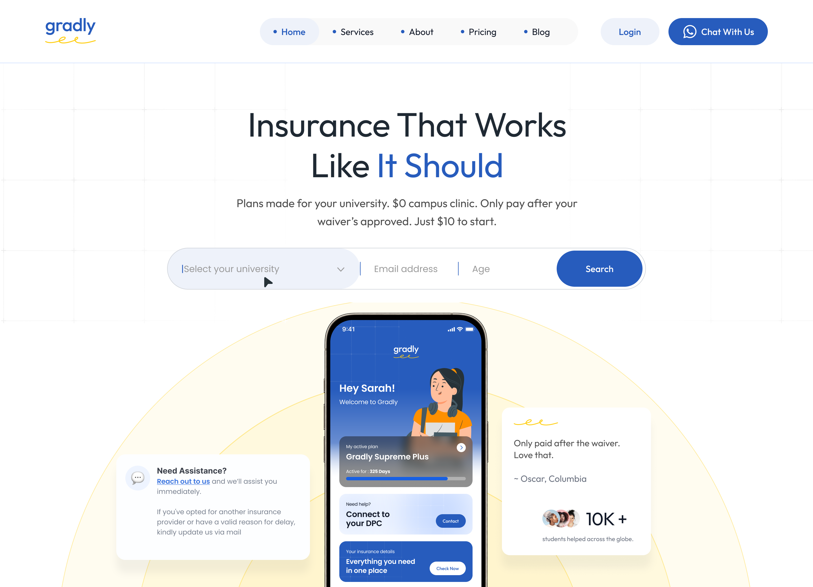
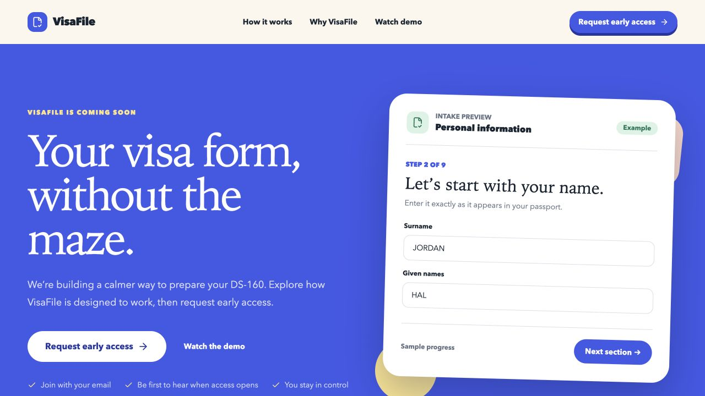
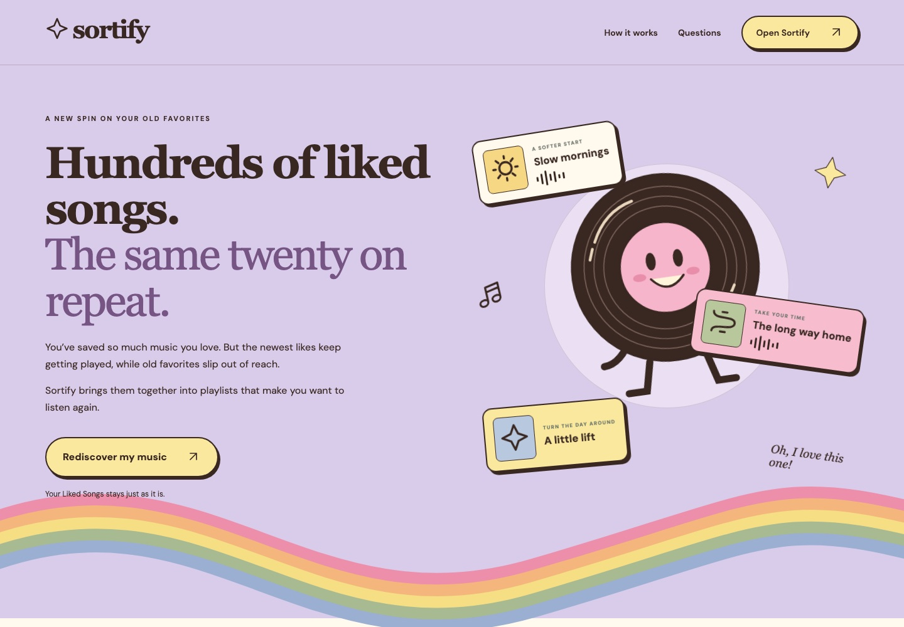
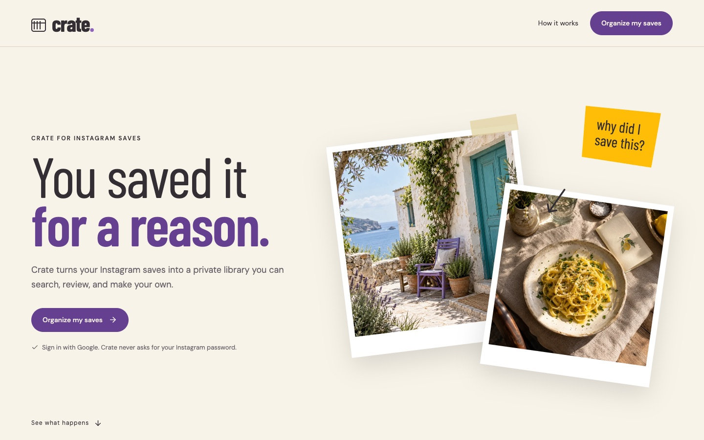

<picture>
  <source media="(prefers-color-scheme: dark)" srcset="assets/header-dark.svg">
  <source media="(prefers-color-scheme: light)" srcset="assets/header-light.svg">
  
</picture>

# Animesh Sharma — Engineer with product sense.

I find the problem, follow the threads, and build something useful. My work moves between software, AI, and automation—and between the product people see and the systems that make it work.

Incomplete requirements invite better questions. Repetitive work invites a better system. I like starting with both, then staying close enough to see what happens after the software ships.

[Portfolio](https://www.animesh.cc/) · [Résumé](https://www.animesh.cc/resume.pdf) · [Blog](https://blog.animesh.cc/)

---

### Selected work

<table>
  <tr>
    <td width="50%" valign="top">
      
      <h3>Gradly</h3>
      
Product, engineering &amp; operations

      
Founding engineer, Technical Lead, Chief of Staff: the scope grew, and I kept building. Web and mobile products, carrier integrations, internal tools, and AI-assisted workflows connect the customer experience to the operations behind it.

      
<a href="https://insurance.gradly.us/">Explore</a>

    </td>
    <td width="50%" valign="top">
      
      <h3>VisaFile</h3>
      
Application automation

      
A long form, a more considered path through it. Guided intake becomes an automated DS-160 application run, pausing for CAPTCHA and live corrections. The worker carries the answers; the user stays involved.

      
<a href="https://visafile-phi.vercel.app/">Explore</a> · <a href="https://github.com/animesh-algorithm/visafile">Source</a>

    </td>
  </tr>
  <tr>
    <td width="50%" valign="top">
      
      <h3>Sortify</h3>
      
Music &amp; machine learning

      
A new way back to old favorites. Musical patterns become Spotify playlist drafts. Review them, reshape them, approve them—then create new private playlists. The library supplies the songs; the listener gets the last word.

      
<a href="https://sortifi.vercel.app/">Explore</a> · <a href="https://github.com/animesh-algorithm/sortify">Source</a>

    </td>
    <td width="50%" valign="top">
      
      <h3>Crate</h3>
      
Private libraries &amp; on-device AI

      
Saved for a reason. Found when you need it. An Instagram export becomes a private library of collections, notes, and searchable saves. Semantic search runs on-device; suggested collections stay drafts until you save them.

      
<a href="https://crate-nu-lilac.vercel.app/">Explore</a> · <a href="https://github.com/animesh-algorithm/crate">Source</a>

    </td>
  </tr>
</table>

---

### Tools I build with

**Languages** — TypeScript · JavaScript · Python · SQL

---

**Web & mobile** — React · Next.js · React Native · Vite · React Router

---

**Interface & interaction** — Tailwind CSS · shadcn/ui · Framer Motion · CSS design tokens

---

**Backend & APIs** — Node.js · Fastify · REST APIs · WebSocket · OAuth

---

**Databases & storage** — PostgreSQL · SQLite · Turso / libSQL · Drizzle ORM · Firestore · IndexedDB / Dexie · S3

---

**AI & machine learning** — OpenAI · LangChain · LlamaIndex · Transformers.js · Pinecone · RAG · AI agents · embeddings · semantic search · clustering · AI evaluations

---

**Automation & integrations** — Puppeteer · Redis · BullMQ · Inngest · Spotify API · Front API · ACH payments · insurance carrier integrations

---

**Cloud & delivery** — Google Cloud · Firebase · Vercel · Docker · Git / GitHub

---

### Notes & rabbit holes

Some problems become products. Others become pages. I write about software, automation, and the decisions that shape what we build.

- [Prototype before architecture](https://blog.animesh.cc/prototype-before-architecture)
- [I don’t automate tasks. I automate roles.](https://blog.animesh.cc/i-dont-automate-tasks-i-automate-roles)

[Rest of the notebook ↗](https://blog.animesh.cc/)

---

A rough idea, a tangled workflow, a question worth following? [Let’s talk](mailto:hello.animeshsharma@gmail.com).

[LinkedIn](https://www.linkedin.com/in/animeshsharma42) · [☕ Buy me a coffee](https://link.animesh.cc/coffee)
