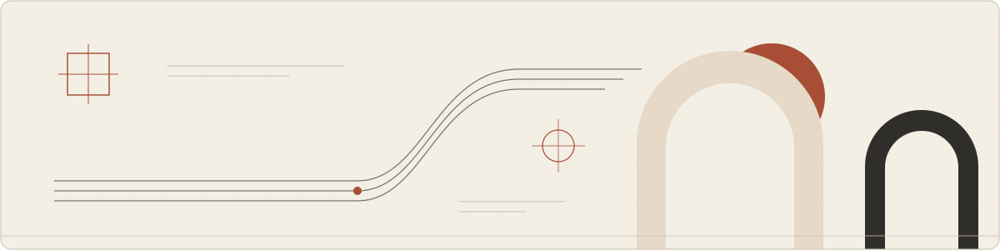

<picture>
  <source media="(prefers-color-scheme: dark)" srcset="assets/header-dark.svg">
  <source media="(prefers-color-scheme: light)" srcset="assets/header-light.svg">
  
</picture>

# Animesh Sharma — Engineer with product sense.

I find the problem, follow the threads, and build something useful. My work moves between software, AI, and automation—and between the product people see and the systems that make it work.

Incomplete requirements invite better questions. Repetitive work invites a better system. I like starting with both, then staying close enough to see what happens after the software ships.

[Portfolio](https://www.animesh.cc/) · [Work with me](https://hire.animesh.cc/) · [Résumé](https://www.animesh.cc/resume.pdf) · [Blog](https://blog.animesh.cc/)

---

### Selected work

**[Gradly](https://insurance.gradly.us/)** · Product, engineering & operations

Founding engineer, Technical Lead, Chief of Staff: the scope grew, and I kept building. At Gradly, I’ve worked across student health insurance—from web and mobile products to member dashboards, carrier integrations, and internal tools. Support, claims, payments: each brings its own complexity. My work connects the customer experience to the operations behind it.

**[VisaFile](https://github.com/animesh-algorithm/visafile)** · Application automation

A long form, a brittle process, a more considered path through it. VisaFile turns guided intake into an automated DS-160 application run, pausing for CAPTCHA and live corrections. The user stays involved at the points that need their attention; the worker carries the answers through the form.

[Explore](https://visafile-phi.vercel.app/) · [Source](https://github.com/animesh-algorithm/visafile)

**[Sortify](https://github.com/animesh-algorithm/sortify)** · Music & machine learning

A new way back to old favorites. Sortify finds musical patterns in a Spotify library and turns them into playlist drafts. Review them, reshape them, approve them—then create new private playlists. The library supplies the songs; the listener gets the last word.

[Explore](https://sortifi.vercel.app/) · [Source](https://github.com/animesh-algorithm/sortify)

**[Crate](https://github.com/animesh-algorithm/crate)** · Private libraries & on-device AI

Saved for a reason. Found when you need it. Crate turns an Instagram export into a private library of collections, notes, and searchable saves. Semantic search runs on-device to surface related captions and notes. Suggested collections stay drafts until you save them: a little help finding order in everything worth keeping.

[Explore](https://crate-nu-lilac.vercel.app/) · [Source](https://github.com/animesh-algorithm/crate)

### Tools I build with

**Languages**  
TypeScript · JavaScript · Python · SQL

**Web & mobile**  
React · Next.js · React Native · Vite · React Router

**Interface & interaction**  
Tailwind CSS · shadcn/ui · Framer Motion · CSS design tokens

**Backend & APIs**  
Node.js · Fastify · REST APIs · WebSocket · OAuth

**Databases & storage**  
PostgreSQL · SQLite · Turso / libSQL · Drizzle ORM · Firestore · IndexedDB / Dexie · S3

**AI & machine learning**  
OpenAI · LangChain · LlamaIndex · Transformers.js · Pinecone  
RAG · AI agents · embeddings · semantic search · clustering · AI evaluations

**Automation & integrations**  
Puppeteer · Redis · BullMQ · Inngest · Spotify API · Front API · ACH payments · insurance carrier integrations

**Cloud & delivery**  
Google Cloud · Firebase · Vercel · Docker · Git / GitHub

### Notes & rabbit holes

Some problems become products. Others become pages. I write about software, automation, and the decisions that shape what we build.

- [Prototype before architecture](https://blog.animesh.cc/prototype-before-architecture)
- [I don’t automate tasks. I automate roles.](https://blog.animesh.cc/i-dont-automate-tasks-i-automate-roles)

---

A rough idea, a tangled workflow, a question worth following? [Let’s talk](mailto:hello.animeshsharma@gmail.com).

[Work with me](https://hire.animesh.cc/) · [LinkedIn](https://www.linkedin.com/in/animeshsharma42)
